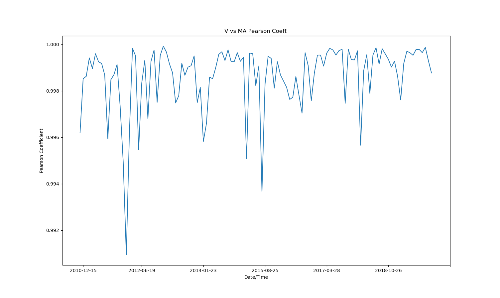
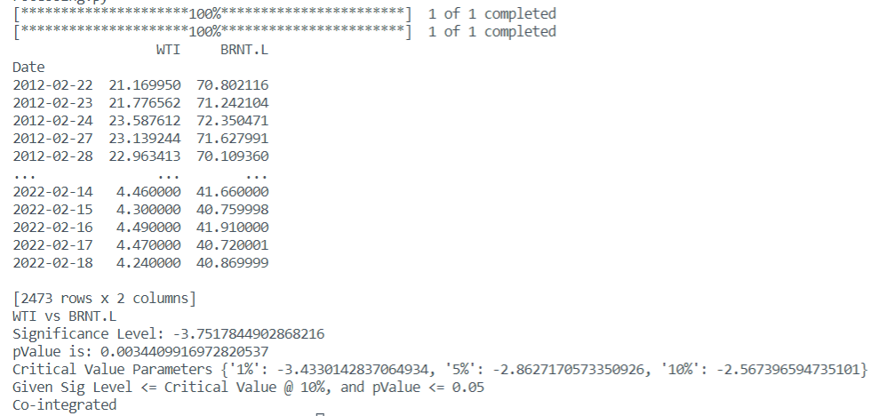
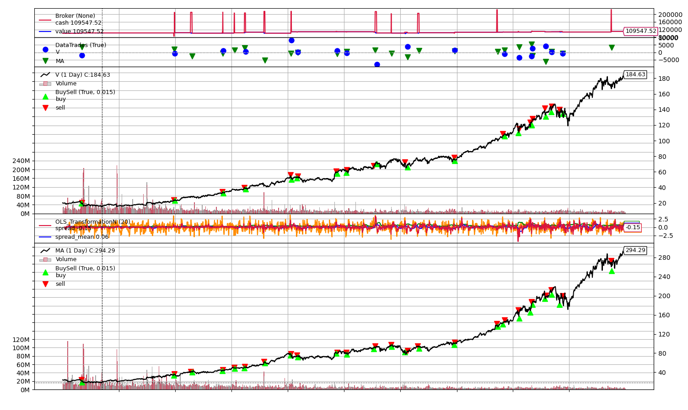
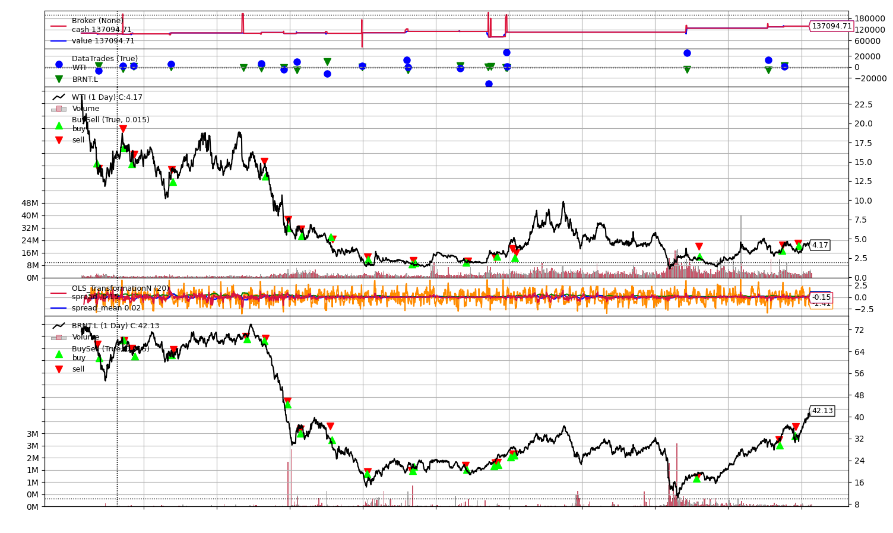
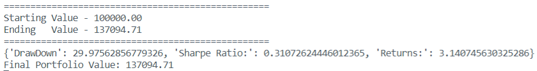
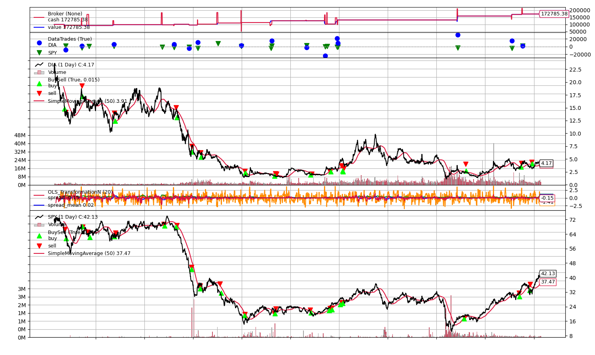
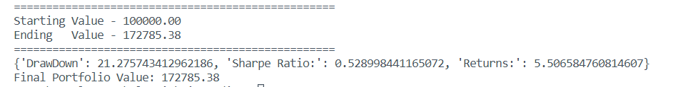

# algorithmicTrading
Experimenting with Algo Trading using Backtrader Python Module.

## Table of Contents
[1 File Structure Information](#File-Structure-Information)  
[2 Pairs Trading](#Pairs-Trading)  
[2.1 Background](#Background)  
[2.2 Results](#Results)   

## File Structure Information:
### main.py 
Takes in a strategy class, a data collection class, and sets the broker cash amount, stake, and commission. It also displays the plot of both the data and trading style, along with the analysis values themselves. In main.py, feel free to edit the:
* Strategy added to the cerebro instance ```cerebro.addstrategy(StrategyToTry)```
* The desired cash amount to test with  ``` cerebro.broker.setcash(Amount) ```
* The commission percentage per trade ``` cerebro.broker.setcommission(commissionAmount) ```

### common/DataCollection
The data used is collected by downloading from yahoo finance. For instance, for the oracle data, the following link was used: https://ca.finance.yahoo.com/quote/ORCL/history?p=ORCL&.tsrc=fin-srch . Ensure that the strategy you pick corresponds to the data that you are using, as the data used in DataCollection will be automatically ingested into the cerebro broker instance, per line 14 in main.py. If you'd like to improve the functionality or specificity of the data collected, feel free to edit the collectData function, that is called in main.py.

### common/AnalyzerSuite
The analyzer suite takes in the strategy, and returns max drawdown, sharpe's ratio, and annualized geometric returns, calculated by backtrader's module. These are the indicators I used to measure success of my models, and I benchmarked the max drawdown to fall below 30%, sharpe's ratio above 0.5, and maximized annualized returns. These analyzers can be changed to varying model requirements per the backtrader analyzer documentation.

### strategies
The strategy in the strategies folder is what should be primarily changed for experimentation, and the layout of these strategies are shown in SimpleMovingAverage, BuyAndHold, and PairsTrading. Begin with SimpleMovingAverage, and BuyAndHold to get a feel for the code and how the module itself works. Here is a link to the Backtrader documentation which is also quite helpful to understand the module and code flow: https://www.backtrader.com/docu/.
We will now move on to the main experimentation done, which was in pairs Trading.

## Pairs Trading
### Background
Pairs trading is a strategy for heding of risk, which involves mathing of the short person with the long position in two underlying securities with a high positive correlation. This offseting of the long and short position is the basis for hedging, and provides profits even with market neutrality. 

The basis of this model is high correlation between the two underlying securities. Thus, the first thing done was to determine correlations between different securities in the same sectors. Once a pair of stocks is identified, whenever the two stocks appear to no longer be correlated, the overpriced stock is shorted, and the undervalued security is bought, assuming that they will come back to the mean correlation, and profit can be made on the mean-reversion. There are two ways to identify this temporary lack of correlation. Either by purely checking the correlation, or using cointegration.

At first, I tried incrementally deducing Pearson's Coefficients for different pairs of securities as shown in the ```DataPreProcessing.py``` file. This would yield results like the following: 

Looks great right! Pearson Coefficient hovering around 0.95 is very correlated. When this was inserted into my model, however, I was obtaining strange results, and the correlated stocks were not always mean reverting. I did a bit more reading and found that I should be using cointegration to deduce my security pairs.

Correlation shows the linear association between two random variables, or bivariate data. In contrast, two sets of variables are cointegrated, if a linear combination of those variables has a lower order of integration. The word "integration" refers to the integrated time series or order d, denoted by I(d). Now, price, rate, yield data can all be assumed as I(1), while returns, can be assumed as I(0) series. An I(0) series is referred to as stationary, which implied that the meanm and variance of the time series are finite and do not change with time. Thus, to solve for co-integration, we say:

$x_t$ and $y_t$ are cointegrated ,if $x_t$ and $y_t$ are $I(1)$ series and $EB$ such that $z_t = x_t - By_t$ is an $I(0)$ series.

So, if there exists this value beta, we can say the series are co-integrated. Cointegration is far more powerful than corrrelation, as it avoids the possibility of spurious correlation. This is when two or more events/variables are associated, but not casually related, due to coincidence, or the presence of a third, unseen variable.

To solve for the existence of co-integration, the Dicky Fuller test can be run. If the pValue was less than 0.05 we can say with 95% conidence that the securities are cointegrated (A few other conditions were checked as well in the ```DataPreProcessing.py -> ADFTEST.py``` function. The results of this test are shown below for WTI crude oil and Brent crude oil, a classic co-integrated pair from date range (2012-02-22 to 2022-02-22):


From here, I can obtain securities with high cointegration, and use the pairs trading model to identify entry and exit points. The model I built uses an ordinary least squares regression between the two securities in question. When the model has a positive z-score above an upper limit, you should short stock 1, and buy stock 2, selling out when the upper-limit band is reached (and we've reached mean-reversion). In contrast, when the model has a negative z-score below a lower limit, you should short stock 2, and buy stock 1, selling out when the lower-limit band is reached (and we've reached mean-reversion).

### Results
The following notable parameters were used to obtain these results:
* Enter at Z-Score of +/- 2.5
* Exit at Z-Score of +/- 0.5
* Period of 20 days
* Only one position open at a time
* Positions sized at 50% Long, 50% Short

Using a correlated pair (Visa, Mastercard) the following results were obtained:



Using a cointegrated pair (WTI Crude Oil, Brent Crude Oil) the following results were obtained:



Clearly, the cointegrated pair, using the same parameters, performed much better than the correlated pair. The parameters for each individual pair could still be tuned to improve performance, but when the same parameters are used, cointegration is the correct approach.

### Position Sizing
One way I wanted to explore improving returns, was deducing a better method for position sizing. Just splitting the long and short position 50/50 didn't quite make sense to me, as the weighting could be optimized by checking how far the price for each individual security was off of it's longer term average. Thus, I experimented with this theory by implementing 50 day simple moving averages for both securities, and weighting the security that was farther off it's average slightly heavier, and vice-versa. We would assume it is more likely have a greater change if it was farther off it's SMA (that would result in more profit). The results can be shown below:


Clearly, the results have improved greatly, still without any specific parameter tuning to the z-score bounds. I would like to explore this topic even deeper in the future, and will talk through some other extensions I would like to continue making to this project.

### Further Thoughts
